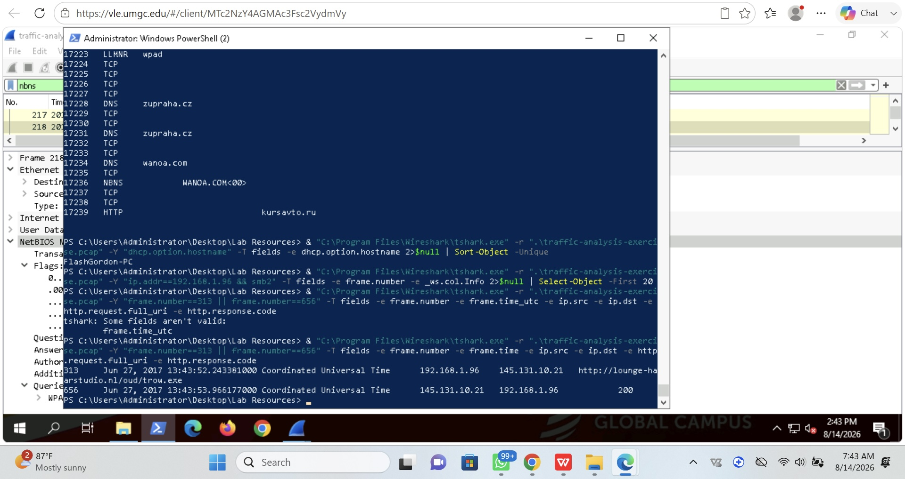
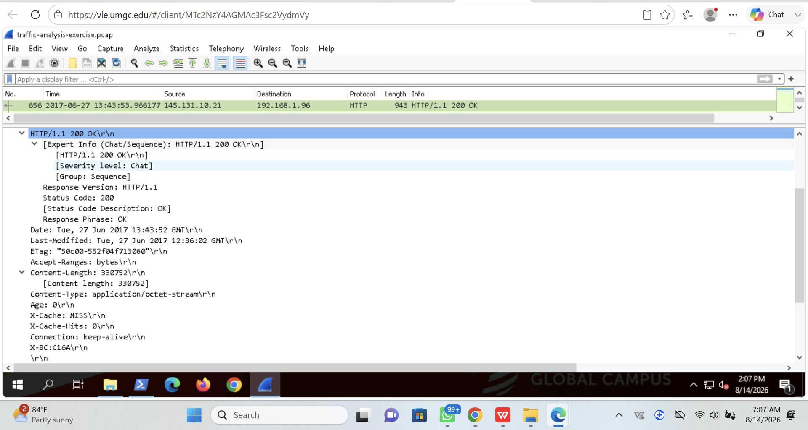
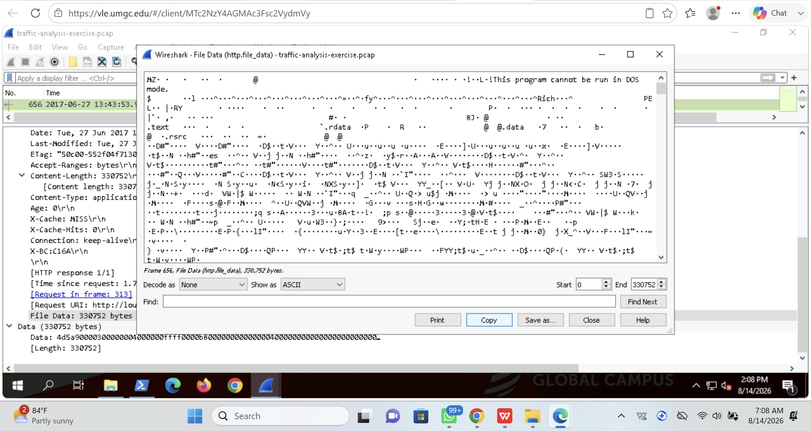

# SOC Incident Investigation Lab

## Overview

This project documents a hands-on Security Operations Center (SOC) investigation of suspicious network activity using Wireshark and PowerShell.

The investigation analyzed a packet capture (PCAP) to identify a potentially compromised Windows endpoint, trace a suspicious executable download, inspect the transferred file, and calculate cryptographic hashes for further analysis.

The objective was to simulate the workflow of a SOC analyst investigating network-based indicators of compromise (IOCs).

---

## Tools Used

- Wireshark
- TShark
- Windows PowerShell
- PCAP network traffic analysis
- SHA-256 hashing
- HTTP and DNS analysis

---

## Investigation Summary

Analysis of the network capture identified suspicious activity associated with the Windows endpoint:

**Hostname:** `FlashGordon-PC`

**Internal IP:** `192.168.1.96`

Network traffic showed the endpoint communicating with external infrastructure and downloading an executable file over HTTP.

A suspicious HTTP request was identified involving:

**External IP:** `145.131.10.21`

**Downloaded file:** `trow.exe`

The HTTP transaction showed the server successfully responding with an HTTP `200 OK`, confirming that file content was transferred to the internal system.

---

## Investigation Evidence

### 1. Suspicious HTTP File Transfer

Wireshark analysis identified an HTTP response from `145.131.10.21` to the internal endpoint `192.168.1.96`.

The server returned:

- HTTP status: `200 OK`
- Content-Type: `application/octet-stream`
- Content-Length: approximately 330 KB

This traffic was associated with the suspicious executable download.

---

### 2. Executable File Identification

Inspection of the HTTP file data revealed an `MZ` header and Portable Executable (PE) structure.

The `MZ` signature is characteristic of Windows executable files and provided additional evidence that the transferred object contained executable content.

---

### 3. SHA-256 File Analysis

PowerShell and TShark were used to extract HTTP file data from selected packets and calculate SHA-256 hashes.

Hashing provides a repeatable identifier that analysts can use to compare suspicious files against threat-intelligence sources and malware repositories.

---

### 4. Compromised Host Investigation

Further analysis associated the suspicious activity with:

`FlashGordon-PC`

The investigation connected the internal host `192.168.1.96` with an HTTP request for `trow.exe` and the corresponding HTTP response from `145.131.10.21`.

This correlation helped reconstruct the sequence of network activity surrounding the suspicious download.

---

## Indicators of Compromise

| Indicator | Type | Description |
|---|---|---|
| `192.168.1.96` | Internal IP | Investigated Windows endpoint |
| `FlashGordon-PC` | Hostname | Host associated with suspicious traffic |
| `145.131.10.21` | External IP | Server involved in HTTP file transfer |
| `trow.exe` | File | Suspicious Windows executable |
| `lounge-hair-studio.nl` | Domain | Domain observed in executable download traffic |

Additional suspicious domains observed during network analysis included:

- `zupraha.cz`
- `wanoa.com`
- `kursavto.ru`

---

## Investigation Workflow

1. Loaded the PCAP into Wireshark.
2. Identified the primary internal endpoint involved in suspicious traffic.
3. Examined DNS, DHCP, NBNS, and HTTP activity.
4. Identified the hostname associated with the endpoint.
5. Investigated suspicious external communications.
6. Located an HTTP executable download.
7. Correlated the HTTP request with its `200 OK` response.
8. Inspected the transferred file data.
9. Identified the Windows PE executable structure.
10. Used TShark and PowerShell to extract and hash HTTP file data.
11. Documented indicators of compromise and investigation findings.

---

## SOC Skills Demonstrated

This project demonstrates practical experience with:

- Network traffic analysis
- PCAP investigation
- Security event correlation
- HTTP traffic analysis
- DNS analysis
- Endpoint identification
- Indicator of compromise identification
- Suspicious file analysis
- SHA-256 hashing
- Wireshark and TShark
- PowerShell
- Incident documentation

---

## Conclusion

The investigation identified a Windows endpoint exhibiting suspicious network behavior and reconstructed an HTTP executable download involving external infrastructure.

By correlating endpoint information, network communications, HTTP transactions, executable file characteristics, and cryptographic hashes, the investigation demonstrates a structured SOC workflow for identifying and documenting potentially malicious activity from network evidence.

---

## Disclaimer

This project was completed in an authorized cybersecurity lab environment for educational and portfolio purposes.
